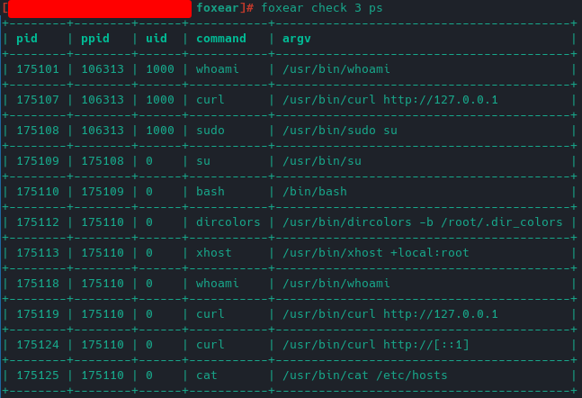
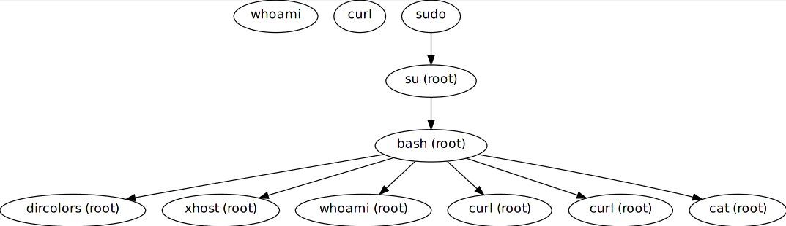
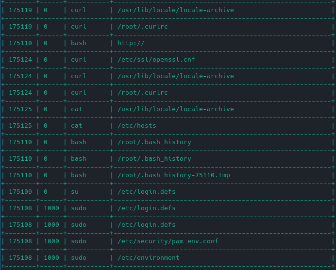
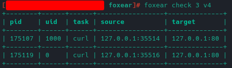
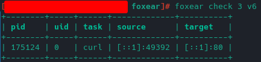

# Example

This example will show you how to use Fox Ear to trace Linux process. Notice Fox Ear store logs in `csv` format, it's easy to load log into other scripts or programs.

First, we opened two terminals, one for Fox Ear, one for our custom command. In the second terminal, we use `echo $$` to get current PID.

```shell
2$ echo $$
106313
```

Now we use Fox Ear to watch this process. As we will load eBPF module into the kernel, we need **root** permission.

```shell
1# foxear watch 106313
Watching PID 106313
Waiting for building eBPF...
Logs are stored at /var/lib/foxear/logs/3
eBPF is ready
```

When `eBPF is ready`, you can use the previous terminal to execute any process that you want.

```shell
2$ whoami
2$ curl http://127.0.0.1
2$ sudo su
2# whoami
2# curl http://127.0.0.1
2# curl http://[::1]
2# cat /etc/hosts
2# exit
```

When all done, you can close this terminal and send `Ctrl-C` to Fox Ear.

## Show process list

As logs are stored at `/var/lib/foxear/logs/3` in the output above, the ID of this task is 3.

```shell
1# foxear check 3 ps
```



## Show process graph

To get the graph showed, you may need tools like [xdot](https://github.com/jrfonseca/xdot.py).

```shell
1# foxear check 3 graph
3$ xdot /var/lib/foxear/logs/3/reports/exec.dot
```



## Show file access

```shell
1# foxear check 3 fs
```



## Show IPv4 TCP connections

```shell
1# foxear check 3 v4
```



## Show IPv6 TCP connections

```shell
1# foxear check 3 v6
```

